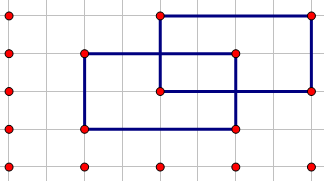
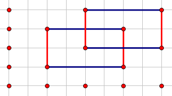
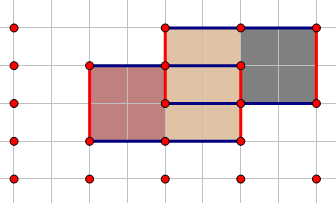

# 扫描线

我们针对[Atlantis问题](https://www.luogu.org/problem/P5490)进行讲解.

  
图1 - 样例

```data
2
100 100 200 200
150 150 250 255
```

我们从左到右扫描所有的纵向边.

  
图2 - 红色边即为依次扫描到的边.

这些边可以用一个结构体记录.需要记录横坐标,上下边界(纵坐标),是一个矩形的结束还是开始.  
扫描这些边时,我们用数据结构维护每个位置纵坐标被矩形覆盖了多少.  
如样例,当$x=100$至$x=150$时,覆盖了$y=100$至$y=200$的部分,当$x=150$至$x=200$时,覆盖了$y=100$至$y=255$的部分,以此类推.注意覆盖的部分不一定是连续的,因此我们数据结构只维护覆盖的长度,即覆盖了$y=100$至$y=200$,我们只记录覆盖长度为$100$.  
然后我们就可以每一段分别求出覆盖的面积并加起来就是答案了.

  
图3 - 这些面积加起来就是答案

然后我们还需要解决怎么维护覆盖长度.  
如果暴力的话复杂度就是$O(n^2)$,很明显不够优秀.  
我们可以使用线段树来维护.具体来说.就是线段树每个节点记录该节点所在区间覆盖的次数(该节点子节点就不用加上去了),是一个矩形的开始,覆盖次数$+1$,是一个矩形的结束,覆盖次数$-1$.  
如果某一个节点覆盖次数为$0$,该节点的权值(即该节点所代表区间总共覆盖的长度)就是该节点左右儿子权值和,否则该节点的权值即为该节点所在区间总长.  
因为矩形左右两边都是相等的,所以这样做是正确的.  
还有,需要注意一点,线段树维护的是每一小段区间覆盖次数,而不是点的覆盖次数,记录点的覆盖次数没有意义.  
具体请参考代码.

# 代码


```cpp
#include<bits/stdc++.h>
using namespace std;
#define MAXN 100005
#define i64 long long
#define open(s) freopen( s".in", "r", stdin ), freopen( s".out", "w", stdout )
#define fp( i, b, e ) for ( int i(b), I(e); i <= I; ++i )
#define fd( i, b, e ) for ( int i(b), I(e); i >= I; --i )
#define go( i, b ) for ( int i(b), v(to[i]); i; v = to[i = nxt[i]] )
template<typename T> inline void cmax( T &x, T y ){ x < y ? x = y : x; }
template<typename T> inline void cmin( T &x, T y ){ y < x ? x = y : x; }
#define getchar() ( p1 == p2 && ( p1 = bf, p2 = bf + fread( bf, 1, 1 << 21, stdin ), p1 == p2 ) ? EOF : *p1++ )
char bf[1 << 21], *p1(bf), *p2(bf);
template<typename T>
inline void read( T &x ){ char t(getchar()), flg(0); x = 0;
	for ( ; !isdigit(t); t = getchar() ) flg = t == '-';
	for ( ; isdigit(t); t = getchar() ) x = x * 10 + ( t & 15 );
	flg ? x = -x : x;
}
clock_t t_bg, t_ed;

int T, N, NN, n;
int a[MAXN << 1], b[MAXN << 1]; i64 ans;//注意ans要开long long
struct node{
	int x, u, d, v; // x表示位置,u表示上区间,d表示下区间
	bool operator < ( const node &t )const{ return x < t.x; } //按位置排序
}q[MAXN << 1];

int tr[MAXN << 3]; int s[MAXN << 3];//因为区间个数就是MAXN*2级别的,再*4就是MAXN*8
// tr表示该节点所代表区间被覆盖的长度,s表示覆盖次数

void Add( int c, int l, int r, int L, int R, int v ){
	if ( L > r || l > R ) return;
	const int mid((l + r) >> 1), ls(c << 1), rs(ls | 1);
	if ( L <= l && r <= R ) return tr[c] = !(s[c] += v) ? l == r ? 0 : tr[ls] + tr[rs] : ( b[r + 1] - b[l] ), void();
	Add( ls, l, mid, L, R, v ), Add( rs, mid + 1, r, L, R, v );
	!s[c] ? tr[c] = tr[ls] + tr[rs] : 0;
}

signed main(){
	t_bg = clock();
	read(N); NN = N << 1;
	for ( int i = 0; i < NN; i += 2 )
		read(q[i].x), read(a[i]), read(q[i + 1].x), read(a[i + 1]),
		b[i] = a[i], b[i + 1] = a[i + 1], q[i].v = 1, q[i + 1].v = -1;//+1表示该段覆盖次数+1,-1同理
	sort( b, b + NN ), n = unique( b, b + NN ) - b;//因为坐标是1e9级别的,所以需要离散化或动态开点线段树	
	for ( int i = 0, t1, t2; i < NN; i += 2 ) 
		t1 = lower_bound( b, b + n, a[i] ) - b, q[i].d = q[i+1].d = t1,
		t2 = lower_bound( b, b + n, a[i+1] ) - b, q[i].u = q[i+1].u = t2;
	sort( q, q + NN ), Add(1, 0, n - 2, q[0].d, q[0].u - 1, q[0].v);
	
	fp( i, 1, NN - 1 )
		ans += 1ll * tr[1] * ( q[i].x - q[i - 1].x ),//加上每一段
		Add( 1, 0, n - 2, q[i].d, q[i].u - 1, q[i].v );
	printf( "%lld\n", ans );
	t_ed = clock();
	fprintf( stderr, "\n========info========\ntime : %.3f\n====================\n", (double)( t_ed - t_bg ) / CLOCKS_PER_SEC );
	return 0;
}

```

# 练习

- [x] [洛谷 P5490 【模板】扫描线](https://www.luogu.org/problem/P5490) [code](https://github.com/louhc-oi/code/blob/visitor/www.luogu.org/problemnew/show/P5490/code.cpp)
- [x] [HDU1542 Atlantis](http://acm.hdu.edu.cn/showproblem.php?pid=1542) [code](https://github.com/louhc-oi/code/blob/visitor/acm.hdu.edu.cn/1542.cpp)
- [ ] [HDU1828 Picture](http://acm.hdu.edu.cn/showproblem.php?pid=1828) [code]()
- [ ] [HDU3265 Posters](http://acm.hdu.edu.cn/showproblem.php?pid=3265) [code]()
- [ ] [HDU1255 覆盖的面积](http://acm.hdu.edu.cn/showproblem.php?pid=1255) [code]()
